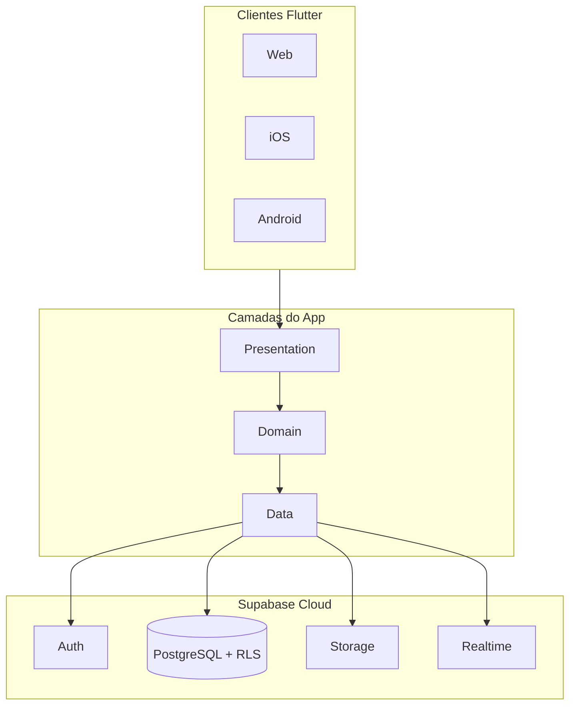
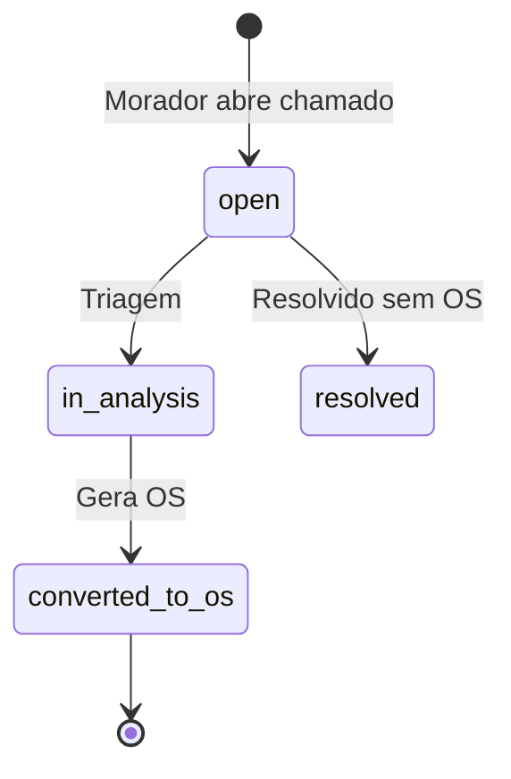

# Arquitetura — Cond Manager

## Visão geral

## Bootstrap e configuração

| Arquivo | Função |
|---------|--------|
| `lib/main.dart` | Entry point + handlers globais de erro |
| `lib/core/config/bootstrap_app.dart` | Splash mint, retry (2x), watchdog 25s, UI de erro com *Tentar novamente* |
| `lib/core/config/supabase_bootstrap.dart` | Init idempotente Supabase, validação/limpeza de sessão persistida |
| `lib/core/config/app_config.dart` | URL + anon key (dart-define → `.env`) |
| `lib/core/config/env_loader.dart` | Lê `.env` do bundle sem `flutter_dotenv` no iOS |
| `lib/app.dart` | `MaterialApp.router` + `AppLoadingScaffold` quando GoRouter `child` é null |

**Ordem de credenciais:** `static const String.fromEnvironment` (compile-time) → `.env` no asset bundle.

**Nunca** chamar `String.fromEnvironment` em runtime (quebra no Web).

**iOS:** scheme `Runner` (Release) para uso pelo ícone; `Runner-Debug` para depuração com LLDB. Builds Debug sem debugger fecham imediatamente.

## Clean Architecture por feature

Cada módulo em `lib/features/<nome>/` segue:

| Camada | Responsabilidade |
|--------|------------------|
| `domain/entities` | Objetos de negócio puros |
| `domain/repositories` | Contratos (interfaces) |
| `data/models` | Serialização JSON ↔ Supabase |
| `data/repositories` | Implementação com Supabase client |
| `presentation/` | UI, providers Riverpod, páginas |

## Shell e navegação

| Plataforma | Comportamento |
|------------|---------------|
| Desktop / tablet largo | Sidebar fixa + conteúdo |
| Mobile | Barra inferior com até **4 atalhos** + item **Menu** |

Personalização mobile:

- `lib/features/shell/data/mobile_nav_shortcuts_storage.dart` — `shared_preferences`
- `lib/features/shell/presentation/providers/mobile_nav_shortcuts_provider.dart`
- `lib/features/shell/presentation/widgets/mobile_nav_shortcuts_sheet.dart`
- Menu completo em `mobile_nav_menu_sheet.dart`

Filtros responsivos:

- `lib/shared/widgets/form/filter_carousel_layout.dart` — carrossel no mobile
- `lib/shared/widgets/form/responsive_filter_layout.dart` — grid desktop / carrossel mobile

## Dois módulos de negócio

| `AppModule` | Home | Features |
|-------------|------|----------|
| `maintenance` | `/` | tickets, work_orders, materials, preventive, financial |
| `rental` | `/rental` | properties, leases, bookings, calendar, charges, expenses |

Router: `lib/core/router/app_router.dart`  
Permissões: `lib/core/permissions/app_permissions.dart`

## Modelo de dados (resumo)

### Núcleo operacional

- **condominiums** → blocos, torres, unidades, áreas comuns, equipamentos
- **profiles** + **user_condominium_roles** → multi-tenant por condomínio
- **tickets** → chamados com anexos e interações
- **work_orders** → OS com materiais, mão de obra, aprovações
- **preventive_plans** → planos com checklist e execuções

### Locação (`00028`+)

- **rental_properties**, **rental_leases**, **rental_bookings**
- **rental_parties**, **rental_charges**
- **rental_property_inclusions**, **rental_property_photos**
- **financial_records** com campos rental (despesas, alocação por unidade/bloco)

### Fluxo chamado → OS

## Row Level Security

Funções auxiliares (migration `00010` + extensões):

| Função | Uso |
|--------|-----|
| `is_platform_admin()` | Acesso global |
| `has_condominium_access(id)` | Leitura no condomínio |
| `can_manage_condominium(id)` | CRUD estrutural |
| `can_approve_work_orders(id)` | Aprovações |
| `can_view_financial(id)` | Módulo financeiro |

## Storage (buckets)

| Bucket | Conteúdo |
|--------|----------|
| `avatars` | Fotos de perfil |
| `condominium-assets` | Logo e assets |
| `tickets` | Fotos de chamados |
| `work-orders` | Antes/durante/depois |
| `provider-documents` | Certidões |
| `signatures` | Assinaturas |
| `rental-expense-receipts` | NF/recibo das despesas de locação (`00054`) |

## Realtime

Tabelas publicadas: `tickets`, `work_orders`, `notifications`, `work_order_approvals`.

## Design system

- Tokens: `lib/core/theme/clay_tokens.dart`
- Tema: `lib/core/theme/app_theme.dart`
- Widgets: `lib/shared/widgets/clay/`

## Convenções de código

- Enums Dart espelham enums PostgreSQL (`value` = nome no banco)
- `Result<T>` para operações que podem falhar
- Providers Riverpod por feature em `presentation/providers/`
- Breakpoint mobile comum: `MediaQuery.sizeOf(context).width < 640`
- Filtros multi-campo: `ResponsiveFilterLayout` + `MonthFilterBar` (`lib/shared/widgets/form/`)
- Financeiro manutenção: `excludeRentalModule` omite `rental_expense_entry_type`, `allocation_parent_id` e `rental_charge_id`
- Nunca expor `service_role` key no cliente

## Migrations

54 arquivos em `supabase/migrations/` (`00001` … `00054`).  
Índice completo em `docs/cond_manager_system_blueprint.json` → `database.migrationsIndex`.

Destaques recentes:

| ID | Tema |
|----|------|
| `00053` | Multi-tenant: `management_company_id` em lançamentos, RLS financeiro e storage |
| `00054` | Anexos de despesas (`rental_expense_attachments`, bucket `rental-expense-receipts`) |
