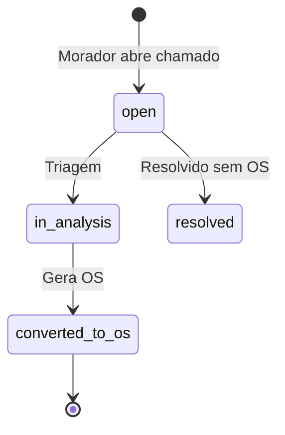

# Arquitetura — Cond Manager

## Visão geral

```mermaid
flowchart TB
  subgraph clients [Clientes Flutter]
    Web[Web]
    iOS[iOS]
    Android[Android]
  end

  subgraph app [Camadas do App]
    UI[Presentation]
  end --> Domain[Domain]
    Domain --> Data[Data]
  end

  subgraph supabase [Supabase Cloud]
    Auth[Auth]
    DB[(PostgreSQL + RLS)]
    Storage[Storage]
    RT[Realtime]
  end

  Data --> Auth
  Data --> DB
  Data --> Storage
  Data --> RT
  clients --> UI
```

## Clean Architecture por feature

Cada módulo em `lib/features/<nome>/` segue:

| Camada | Responsabilidade |
|--------|------------------|
| `domain/entities` | Objetos de negócio puros |
| `domain/repositories` | Contratos (interfaces) |
| `data/models` | Serialização JSON ↔ Supabase |
| `data/repositories` | Implementação com Supabase client |
| `presentation/` | UI, providers Riverpod, páginas |

## Modelo de dados (resumo)

### Núcleo operacional

- **condominiums** → blocos, torres, unidades, áreas comuns, equipamentos
- **profiles** + **user_condominium_roles** → multi-tenant por condomínio
- **tickets** → chamados com anexos e interações
- **work_orders** → OS com materiais, mão de obra, aprovações, histórico de status
- **preventive_plans** → planos com checklist e execuções

### Cadastros auxiliares

- **providers** (fornecedor, terceirizado, quarteirizado, equipe interna)
- **materials** + **stock_movements**
- **financial_records**

### Fluxo chamado → OS



### Status da Ordem de Serviço

`open` → `triage` → `waiting_budget` → `budget_received` → `waiting_approval` → `approved` → `in_progress` → `completed` → `closed`

Estados alternativos: `paused`, `waiting_material`, `rejected`, `cancelled`.

## Row Level Security

Funções auxiliares (migration `00010`):

| Função | Uso |
|--------|-----|
| `is_platform_admin()` | Acesso global |
| `has_condominium_access(id)` | Leitura no condomínio |
| `can_manage_condominium(id)` | CRUD estrutural |
| `can_approve_work_orders(id)` | Aprovações de orçamento/execução |
| `can_view_financial(id)` | Módulo financeiro |

Moradores (`resident`) veem apenas seus próprios chamados, salvo exceções definidas nas policies de `tickets`.

## Storage (buckets)

| Bucket | Conteúdo |
|--------|----------|
| `avatars` | Fotos de perfil |
| `condominium-assets` | Logo e assets do condomínio |
| `tickets` | Fotos de chamados |
| `work-orders` | Antes/durante/depois, documentos |
| `provider-documents` | Certidões e contratos |
| `signatures` | Assinaturas de aceite |

Padrão de path sugerido: `{condominium_id}/{entity_id}/{filename}`.

## Realtime

Tabelas publicadas: `tickets`, `work_orders`, `notifications`, `work_order_approvals`.

Use no Flutter:

```dart
supabase.from('tickets').stream(primaryKey: ['id']).eq('condominium_id', id);
```

## Próximas implementações recomendadas

1. **Condomínios** — CRUD completo + seletor de condomínio ativo no shell
2. **Chamados** — formulário com upload para bucket `tickets`
3. **OS** — máquina de estados na UI alinhada ao enum `work_order_status`
4. **Edge Functions** — geração automática de OS a partir de `preventive_plans`
5. **Notificações push** — FCM + tabela `notifications`

## Convenções de código

- Enums Dart espelham enums PostgreSQL (`value` = nome no banco)
- `Result<T>` para operações que podem falhar
- Providers Riverpod por feature em `presentation/providers/`
- Nunca expor `service_role` key no cliente
